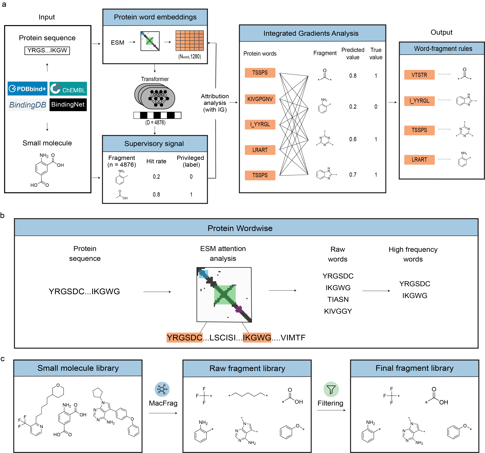

# PWRules

[](https://www.python.org/downloads/)
[](https://pytorch.org/)
[](LICENSE)

&gt; **Paper**: ***An Interpretable Framework Applying Protein Words to Predict Protein–Small Molecule Complementary Pairing Rules*** ([arXiv:2604.16550](https://arxiv.org/abs/2604.16550))  
&gt; **Authors**: Jingke Chen, Jingrui Zhong, Tazneen Hossain Tani, Zidong Su, Xiaochun Zhang, Boxue Tian*

---

## 🔬 Overview

**PWRules** is an interpretable deep learning framework that discovers complementary pairing rules between **protein words** (semantic sequence units) and **small molecule fragments** to guide drug discovery. Unlike "black box" models, PWRules extracts explicit, chemically interpretable rules that can be inspected and leveraged by medicinal chemists.

The framework consists of two main components:

1. **PWRules**: A Transformer-based model that predicts privileged fragments for a given protein and extracts interpretable word–fragment rules via Integrated Gradients (IG).
2. **PWScore**: A scoring function for virtual screening that prioritizes candidate molecules based on predicted privileged fragments and their complementary protein words.


*Figure 1: The PWRules framework workflow. (a) Rule extraction via IG attribution. (b) Protein word extraction with Protein Wordwise. (c) Fragment library generation with MacFrag.*

---

## ✨ Key Features

- **Interpretable Rules**: Explicit protein word–fragment pairing rules instead of black-box predictions
- **Virtual Screening**: PWScore achieves competitive enrichment performance comparable to Glide and PSICHIC
- **Sequence-Only Input**: No experimental structure required — works from protein sequence alone
- **Complementary Integration**: PWScore synergizes with existing methods (Glide, PSICHIC) for improved enrichment
- **Broad Applicability**: Generalizes to unseen targets (e.g., SARS-CoV-2 M<sup>pro</sup>)

---

## 📊 Performance Highlights

| Method                | Dataset | EF_0.5% | EF_1%    | EF_5%   |
|-----------------------|---------|---------------------|----------|---------|
| Glide                 | VSDS-vd RandomDecoy | 12.1                | 10.7     | 6.0     |
| PSICHIC               | VSDS-vd RandomDecoy | 12.6                | 10.8     | 5.8     |
| **PWScore**           | VSDS-vd RandomDecoy | **13.4**            | **11.3** | **5.5** |
| **Glide + PWScore**   | VSDS-vd RandomDecoy | **15.5**            | **13.5** | **7.2** |
| **PSICHIC + PWScore** | VSDS-vd RandomDecoy | **15.5**            | **13.4** | **6.8** |

*PWScore captures complementary interaction information, yielding superior enrichment when integrated with established methods.*

---

## 🚀 Quick Start

> ⚠️ The examples below use a **limited demo rule library** containing only a small subset of protein word–fragment rules for demonstration purposes. 

### Installation

```bash
# Clone the repository
git clone https://github.com/TianBoxue-lab/PWRules.git
cd PWRules

# Create conda environment (recommended)
conda create -n pwrules python=3.9
conda activate pwrules

# Install dependencies
pip install -r requirements.txt

# Install PWRules package
pip install -e .

# Install pytorch
# CUDA 11.8
pip install torch==2.2.2 torchvision==0.17.2 torchaudio==2.2.2 --index-url https://download.pytorch.org/whl/cu118
# CUDA 12.1
pip install torch==2.2.2 torchvision==0.17.2 torchaudio==2.2.2 --index-url https://download.pytorch.org/whl/cu121
```

### Predict Privileged Fragments

```python
from pwrules import RuleMatcher
from pprint import pprint

rule_dir = 'demo/demo_rules'

matcher = RuleMatcher(rule_dir)
results = matcher.predict_fragments(
    fasta_path='demo/demo_sequence.fasta',
    uniprot2word_path='demo/demo_uniprot2word.pkl'
)
pprint(results)
```

### Calculate PWScore for Virtual Screening

```python
from pwrules import PWScore
from pprint import pprint

rule_dir = 'demo/demo_rules'

scorer = PWScore(rule_dir)
results = scorer.screen_library(
    fasta_path='demo/demo_sequence.fasta',
    uniprot2word_path='demo/demo_uniprot2word.pkl',
    library_path='demo/demo_library.smi',
    top_k=100
)
pprint(results)
```
---

## 🏗️ Training & Rule Extraction Framework

If you wish to train PWRules on your own protein–ligand binding data and extract interpretable word–fragment rules via Integrated Gradients (IG), we provide a modular training and explainability framework.

> ⚠️ The training scripts below provide a **simplified framework** for custom model training and rule extraction. A [**demo training dataset**](https://cloud.tsinghua.edu.cn/d/2abf85606e7e4930bc4e/) is included for reference.


### 1. Train PWRules Model

```python
from pwrules import PWRulesTrainer

trainer = PWRulesTrainer(config_path='configs/pwrules_config.yaml')

trainer.train(
    train_data_path='demo/demo_train.pkl',
    val_data_path='demo/demo_valid.pkl'
)
```

### 2. Extract Rules via Integrated Gradients

```python
from pwrules import RuleExtractor

extractor = RuleExtractor(
    config_path='configs/pwrules_config.yaml',
    checkpoint_path='weight/demo_pwrules.pkl'
)

extractor.extract_rules(
    train_data_path='demo/demo_train.pkl',
    val_data_path='demo/demo_valid.pkl'
)
```

---

## 📖 Citation

If you use PWRules or PWScore in your research, please cite:

```bibtex
@article{chen2026pwrules,
  title={An Interpretable Framework Applying Protein Words to Predict Protein--Small Molecule Complementary Pairing Rules},
  author={Chen, Jingke and Zhong, Jingrui and Tani, Tazneen Hossain and Su, Zidong and Zhang, Xiaochun and Tian, Boxue},
  journal={arXiv preprint arXiv:2604.16550},
  year={2026},
  eprint={2604.16550},
  archivePrefix={arXiv},
}
```

---

## 📜 License

This project is licensed under the MIT License - see the [LICENSE](LICENSE) file for details.

**Important**: The demo data and code are provided for academic research and validation purposes.

---

## 🙏 Acknowledgments

- [ProteinWordwise](https://github.com/TianBoxue-lab/ProteinWordwise) for protein word extraction
- [ESM-2](https://github.com/facebookresearch/esm) for protein language model embeddings
- [MacFrag](https://github.com/yydiao1025/MacFrag/tree/main) for molecular fragmentation
- [Captum](https://captum.ai/) for Integrated Gradients implementation
- [RDKit](https://www.rdkit.org/) for cheminformatics utilities

